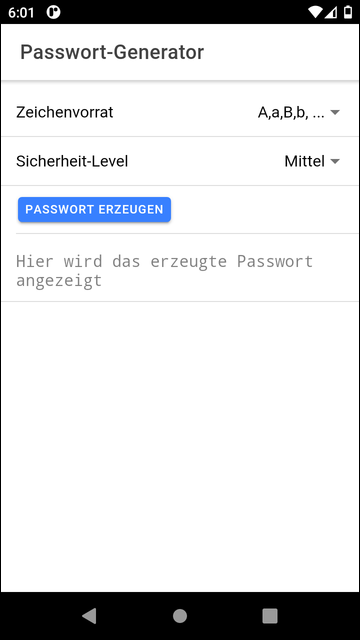
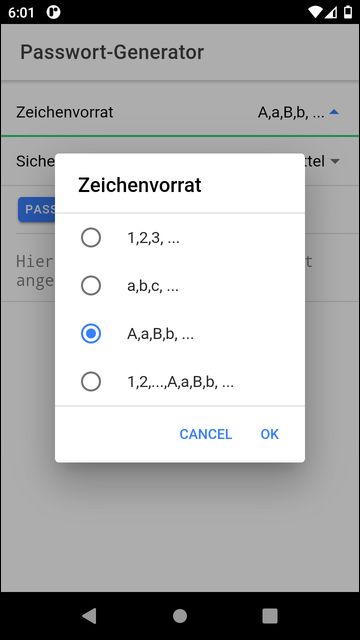
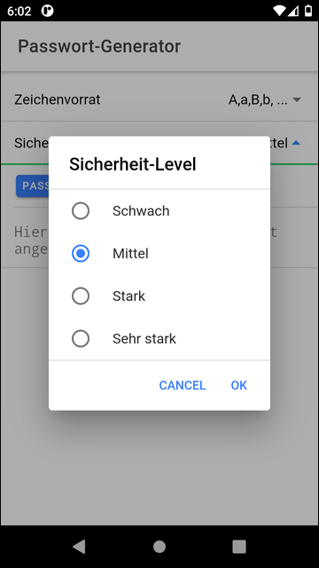
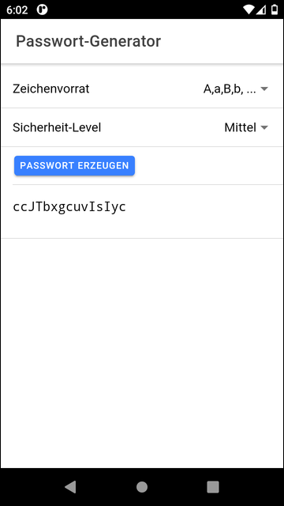

# Ionic app to generate a password #

Simple Ionic/Angular app with Capacitor, which generates a random password based on the chosen character set
and length (security level).

**Do not use the passwords generated by this app for productive usecases, because the password generation
uses the random generator offered by the browser's JavaScript engine, and this random generator might not
be good enough for security applications.**

 

----

## Screenshots ##

 

 &nbsp;     

 &nbsp;     

 

----

## License ##

See the [LICENSE file](LICENSE.md) for license rights and limitations (BSD 3-Clause License) for the files
in this repository.

 
